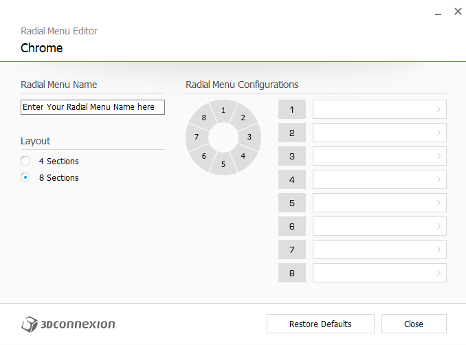
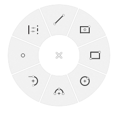
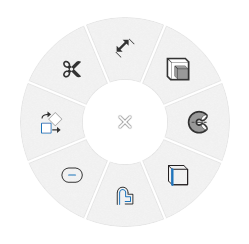
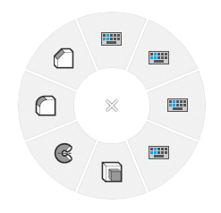
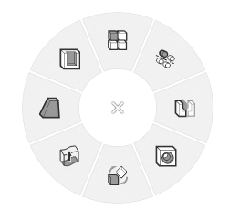
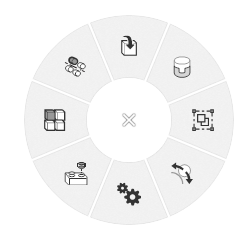
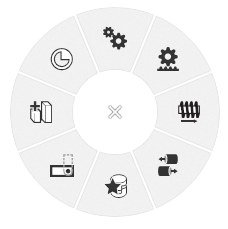
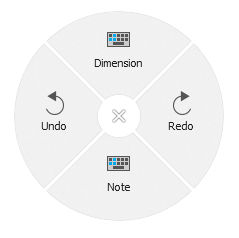

# 3Dconnexion with Onshape & Odoo
Configuration files for the 3Dconnexion CADMouse wireless and SpaceMouse Wireless.

## Configuring 3Dconnexion CADMouse wireless and SpaceMouse Wireless
The configuration of the 3Dconnexion CADMouse wireless and the SpaceMouse Wireless is stored in a few files in XML format.

These files are in the path "C:\Users\USERNAME\AppData\Roaming\3Dconnexion\3DxWare\Cfg"

- The Onshape configuration file is "Onshape.xml". 
- The Onshape Drawings configuration file is "Onshape Drawings.xml"
- The Google chrome configuration file is "Chrome.xml". The Google Chrome configuration file is optimized to work with the Open Source ERP Odoo.

You can edit the configuration trought the program "3Dconnexion properties":
1. In the Start menu of Windows, search for "3Dconnexion properties"
2. or press the "Menu" button in the 3Dconnexion SpacePilot Pro

Also you can import the configuration file "Onshape & Odoo.3dxz" trought the program "3Dconnexion properties":
1. Press the link "More >" and select "Import settings"
2. Select the "Onshape & Odoo.3dxz" file.

## Radial Menus
The radial menus can be set with 4 or 8 sections.

### Radial menu with 4 sections

### Radial menu with 8 sections

## Sketch
### Sketch 1

1. Line
2. Center point rectangle
3. Corner rectangle
4. Center point circle
5. 3 point arc
6. Tangent arc
7. Point
8. Construction

### Sketch 2

1. Dimension
2. Extrude
3. Revolve
4. Use
5. Offset
6. Slot
7. Transform
8. Trim

### Sketch Constraints

1. Coincident
2. Concentric
3. Horizontal
4. Equal
5. Vertical
6. Parallel
7. Perpendicular
8. Tangent

## Part Studios
### Part Studio 1

1. New Sketch + Normal view + Line
2. New Sketch + Normal view + Center point circle
3. New Sketch + Normal view + Center point rectangle
4. New Sketch + Normal view + Corner rectangle
5. Extrude
6. Revolve
7. Fillet
8. Construction

The first 4 sections are simple macros. You need to select a plane or planar face and they will create a new sketch, set the normal view and run the command:
1. Line
2. Center point circle
3. Center point rectangle
4. Corner rectangle

You can see a tooltip over each section to recognize it.

### Part Studio 2

1. Linear pattern
2. Circular pattern
3. Mirror
4. Hole
5. Transform
6. Thicken
7. Draft
8. Shell

### Part Studio 3

1. Sheet metal model
2. Flange
3. Tab
4. Delete face
5. Move face
6. Boolean
7. Plane
8. Helix

## Assemblies
### Assembly 1

1. Insert
2. Mates (You can select a different mate if you want)
3. Group
4. Tangent mate
5. Relations (You can select a different relation if you want)
6. Replicate
7. Assembly linear pattern
8. Assembly circular pattern

### Assembly 2

1. Gear relation
2. Rack and pinion relation
3. Screw relation
4. Linear relation
5. Snap mode
6. Named positions
7. Create Part Studio in context
8. Mate connector

### Assembly Mates

1. Fastened mate
2. Revolute mate
3. Slider mate
4. Planar mate
5. Cylindrical mate
6. Pin slot mate
7. Ball mate
8. Parallel mate

## Drawings
### Drawings 1

1. Dimension
2. Redo
3. Note
4. Undo

## Odoo (Google Chrome)

The setting of Google Chrome were improved to work with the Open Source ERP Odoo.

1. Edit a record (ALT + A)
2. Save a record (ALT + S)
3. Open the Next record (ALT + N)
4. Open the Kanban view (ALT + K)
5. Create a new record (ALT + C)
6. Open the List view (ALT + L)
7. Open the Previous record (ALT + P)
8. Discard a record modification (ALT + J)

